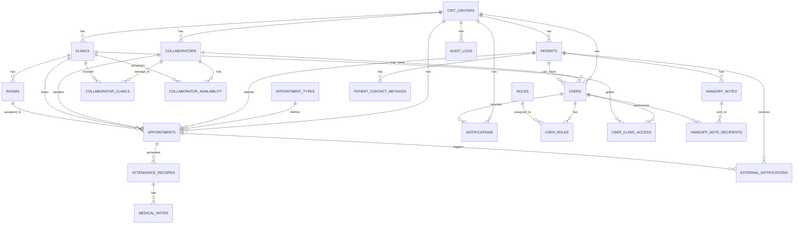

# crit-db

Repositorio de base de datos para el sistema de optimización de asistencias del CRIT.

## Propósito

Este repositorio define la estructura inicial de PostgreSQL para soportar:

- Multi-CRIT.
- Usuarios y roles.
- Clínicas y cuartos.
- Pacientes.
- Colaboradores.
- Calendario y citas.
- Asistencias.
- Nota médica.
- Notas de enlace.
- Notificaciones.
- Integración temporal con API CRIT.
- Auditoría.

## Stack

- PostgreSQL.
- Docker.
- SQL migrations manuales.
- Seeds.
- Mermaid ERD.
- Diccionario de datos.

## Estructura

```txt
crit-db/
├── docker/
│   └── postgres/
│       ├── Dockerfile
│       └── init/
├── migrations/
├── seeds/
├── schema/
│   ├── erd.mmd
│   └── tables/
├── docs/
├── scripts/
├── .env.example
├── Dockerfile
├── docker-compose.yml
└── README.md
```

## Decisión de diseño

Aunque el MVP se probará en CRIT Occidente, la base se prepara para varios CRIT desde el inicio mediante la tabla:

```txt
crit_centers
```

Las tablas principales tendrán relación con `crit_center_id`.

## Tablas principales

```txt
crit_centers
users
roles
user_roles
user_clinic_access
patients
collaborators
clinics
rooms
collaborator_clinics
appointment_types
collaborator_availability
appointments
attendance_records
medical_notes
handoff_notes
handoff_note_recipients
notifications
patient_contact_methods
external_notifications
crit_api_outbox
audit_logs
```

## Mermaid ERD inicial

Ver también:

```txt
schema/erd.mmd
```



## Notas importantes

- No se modela módulo de pagos porque está fuera del MVP.
- La nota médica se guarda como datos, no como PDF.
- El PDF se genera desde frontend cuando el usuario lo necesite.
- WhatsApp/SMS debe quedar preparado, pero no implementarse al inicio.
- El autosugerido de agenda debe quedar preparado, pero implementarse al final del MVP.
